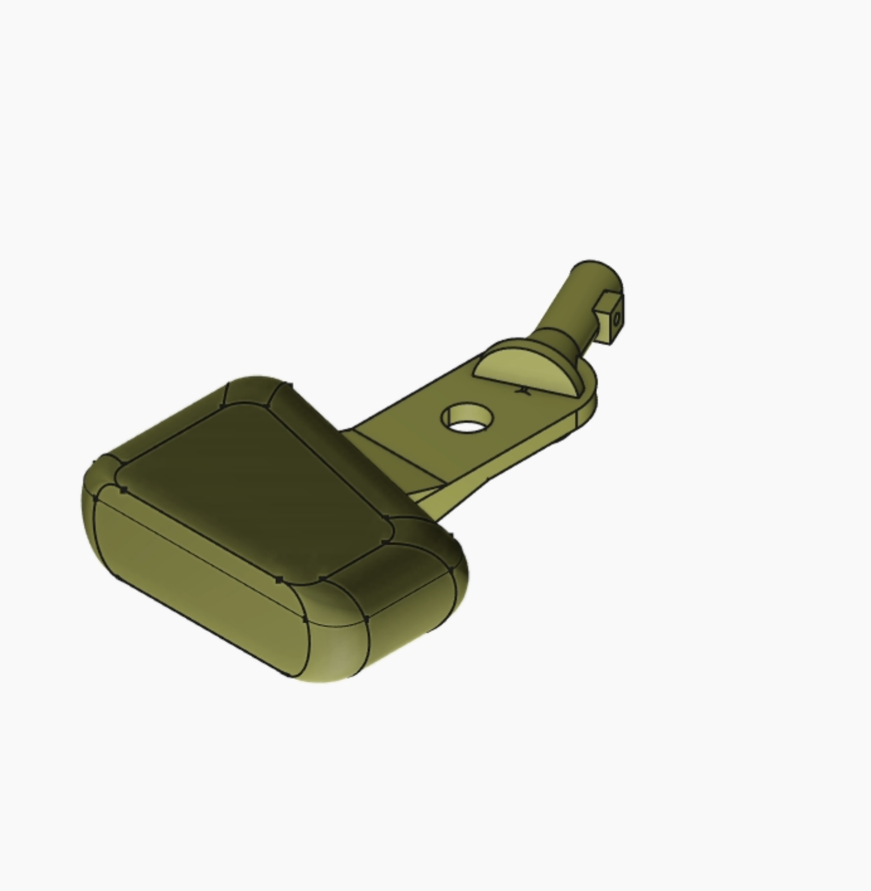

# Flag Anchor

A flag mount designed to display a flag from a backpack cup holder.

The bracket clips into a standard backpack cup/bottle holder and holds a flag pole at an angle, so you can fly a flag while hiking, camping, biking, or at events — hands-free.

## Photos

## 3D Model

Open [`Rev E.stl`](Rev%20E.stl) above to view and rotate the model right here on GitHub.
